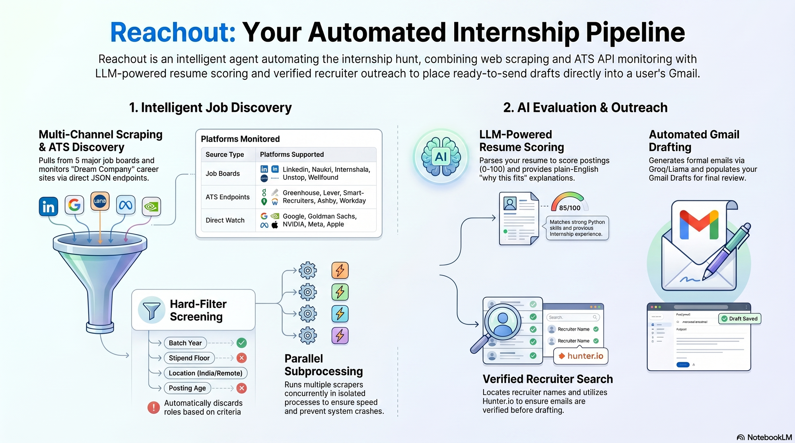

# Reachout — The Cold Mailing Assistant

If you're tired of refreshing job boards and retyping the same "Dear HR, I came
across..." email twenty times a week, this is for you.

Reachout is a small agent that does the boring parts of the internship hunt. It
scrapes fresh postings, throws out the ones you're not eligible for, ranks what's
left against your resume, digs up the right recruiter's email, writes a
first-draft cold email, and drops it into your Gmail Drafts so all you have to do
is read it and hit send. Then it keeps an eye on your inbox for replies.

You can run the whole thing from the terminal or from a Streamlit dashboard,
whichever you prefer.

Out of the box it's configured for a 2028 graduating batch, but the batch year,
stipend floor, target roles and pretty much everything else lives in `.env`, so
point it at whatever fits your situation.

## What it actually does

**Pulls from five job boards.** LinkedIn, Naukri, Internshala, Unstop and
Wellfound. Each one is fetched however it's least likely to break — a
browser-session MCP connector for LinkedIn, an Apify actor where one exists, and
a stealthed Patchright browser (the Akamai/Cloudflare-dodging kind) for the rest.
Every source runs in **its own subprocess**, several at a time, so they scrape in
parallel *and* a crash or hang in one site (a wedged browser, a renderer that
dies) is force-killed and skipped instead of taking the whole run down with it.
Tune how many run at once with `SCRAPER_MAX_PARALLEL`.

**Watches your dream companies directly.** This is the standout feature. You keep
a list of companies you'd actually love to intern at — Google, Goldman Sachs,
NVIDIA, the usual suspects, all in `config/target_companies.yaml` — and Reachout
checks their own career sites, not just the boards. Wherever a company runs a
normal ATS (Greenhouse, Lever, SmartRecruiters, Ashby, Workday, or Amazon's jobs
API) it just hits the public JSON endpoint, which is fast, reliable and doesn't
need a browser at all — and it scans all the companies in that round
concurrently. That ATS path is the default.

To cover the long tail, it also **auto-discovers** a company's ATS when no token
is configured (`COMPANY_WATCH_ATS_DISCOVERY`, on by default): it probes
name-slugs against Greenhouse/Lever/Ashby and, failing that, does a quick web
search for the company's ATS board URL (so it picks up the Workday tenants behind
Adobe, Salesforce, Cisco, Intel, and the like). It's all plain HTTP — no browser
— and every result is cached in `state/company_ats.json`, so discovery is a
one-time cost per company. For the companies that expose **no public ATS at all**
(Google, Microsoft, Apple, Meta, Goldman…), it falls back to a **web watch**
(`COMPANY_WATCH_WEB_SEARCH`, on by default): a recency-limited search (last month
only) that forwards a posting *only* when it's a real, specific job on a known job
host (LinkedIn `/jobs/view/`, Naukri, Internshala, …) or the company's own careers
domain — and only after verifying the **employer really is that company** (so a
"Meta Ads" job at an agency never gets mis-filed under Meta). It never invents a
listing and never surfaces anything older than a month. There's *also* an opt-in
browser fallback for custom portals (`COMPANY_WATCH_BROWSER_FALLBACK=1`), off by
default because web-resolved URLs for those tend to land on blogs/heavy SPAs that
stall or crash the renderer.

Net: roughly a third of your target companies are usually reachable directly via
ATS APIs; the rest are watched on the open web and, regardless, show up through
the five job boards where their internships also get posted.

Two rules on that watcher:
- **India only**, but *any* Indian office counts — Bengaluru, Pune, Gurgaon,
  Hyderabad, Noida, wherever, plus India-remote. The goal is to never miss
  something just because it's in a city you didn't think to list. (Adjust the
  city/region logic in config if you're hunting elsewhere.)
- If an internship is actually open to your configured batch (2028 by default),
  it gets pinned to the top with a ⭐ and shown no matter what. It skips the
  stipend and posting-age filters entirely, so a dream-company opening with no
  stipend listed is never quietly dropped.

Manage that list with `python -m src companies ...` or the Companies tab, and run
just the company sweep with `python -m src watch-companies`.

**Reads your resume and scores everything.** It parses `resume.pdf` (or `.docx`)
with an LLM, then gives every posting a 0–100 score using skill embeddings plus
some weighting for domain, location and stipend. Each one comes with a few
plain-English "why this fits you" bullets so you're not squinting at a number. If
the parser misses a skill, you can add it by hand in the dashboard's **Profile
tab** — manually added skills feed scoring and the email draft exactly like
parsed ones, and they stick around even when you swap in a new resume.

**Filters hard before you ever see it.** Wrong batch, asks for experience,
stipend below your floor, too old, not in India and not remote — gone. The
ambiguous ones get handed to an LLM to make the call.

**Finds a real contact.** Recruiter name, title, and a *verified* email (web
search, with Hunter.io if you give it a key). It won't mail a guessed address.

**Writes the email.** Short, formal, via Groq. If Groq is down it falls back to a
plain template so the pipeline never just stops. Drafts go to Gmail (API/OAuth, or
IMAP app password).

**Tracks replies, and can run itself.** It polls Gmail and updates each
opportunity's status, and there's a scheduler that does the daily harvest + reply
check at whatever IST time you set.

A couple of practical notes: internships are seasonal, so on a random day a bunch
of companies will legitimately have zero open India internships — that's not a
bug, the watcher just round-robins through the list and catches them as they
post. And the big custom-portal companies (Google, Microsoft, Apple) don't expose
a public ATS API, so by default the watcher can't see them directly — flip on
`COMPANY_WATCH_BROWSER_FALLBACK` if you want it to try rendering their pages, but
expect it to be slower and hit-or-miss.

## How it's laid out

```
config/        settings (.env) + sites.yaml + target_companies.yaml
src/
  sources/     one adapter per board (linkedin, naukri, ...) + company_careers + ats_api
  companies.py the dream-company watchlist loader
  pipeline/    normalize -> dedup -> filter -> score
  agents/      drafter, recruiter finder, reply tracker, opportunity finder, ...
  contacts/    email finding + verification, Hunter.io, web search
  email/       Gmail API (OAuth) and IMAP draft clients
  llm/         Groq client with a SQLite cache
  profile/     resume parsing + a watcher that re-reads it on change
  orchestrator/  the LangGraph flows (harvest / review / reply_watch)
  storage/     SQLModel + SQLite
  narration/   the friendly console output
ui/            Streamlit service layer + styling
app.py         the dashboard
state/         everything runtime — db, logs, cookies, snapshots (git-ignored)
```

Built with Python 3.13, LangGraph/LangChain, Groq (Llama 3.3 70B), SQLModel/SQLite,
Playwright + Patchright, sentence-transformers, Streamlit, Click and Rich.

## How it all fits together



## Getting it running

**1. Virtualenv and dependencies.**

```bash
git clone <your-repo-url>
cd "Reachout - The Cold Mailing Assistant"
python -m venv .venv
.venv/Scripts/activate          # Windows
# source .venv/bin/activate     # macOS/Linux
pip install -r requirements.txt
python -m playwright install chromium
```

**2. The LinkedIn MCP server.** LinkedIn scraping and HR search go through
[stickerdaniel/linkedin-mcp-server](https://github.com/stickerdaniel/linkedin-mcp-server),
which isn't bundled here. Clone it into the project root and follow its README to
build and log in:

```bash
git clone https://github.com/stickerdaniel/linkedin-mcp-server.git
```

That connector is stickerdaniel's work (and its contributors'), used under its own
license — credit goes to them.

**3. Drop in your resume.** Put `resume.pdf` or `resume.docx` in the project root.
It gets parsed on startup and re-read automatically whenever you change it.

**4. Fill in `.env`.** Copy the example block below into a `.env` file and set at
least your Groq key and Gmail address:

```env
GROQ_API_KEY=your_groq_key            # required, grab one at https://console.groq.com
GMAIL_FROM_ADDRESS=you@example.com
GMAIL_APP_PASSWORD=your_app_password  # only if you're using IMAP drafts
OWNER_NAME=Your Name                  # used in the email signature + scoring
OWNER_EMAIL=you@example.com
OWNER_COLLEGE=Your College
OWNER_BATCH=2028                      # your graduating batch
OWNER_GRADUATION_YEAR=2028
APIFY_TOKEN=                          # optional, turns on the Naukri/Internshala scrapers
HUNTER_API_KEY=                       # optional, better verified-email hit rate
HARVEST_TIME_IST=08:00
DRY_RUN_EMAIL=0                       # set to 1 to write drafts to disk instead of Gmail
```

**5. Authorize Gmail once.** To create drafts through the Gmail API, drop a
Desktop OAuth client JSON in the root as `gmail_credentials.json` and run:

```bash
python -m src gmail-auth
```

## Using it

The dashboard is the friendliest way in:

```bash
python -m streamlit run app.py
```

But everything's on the CLI too:

```bash
python -m src harvest          # scrape everything, filter, score, save
python -m src watch-companies  # just the target-company career sites
python -m src review           # go through opportunities one by one, draft emails
python -m src watch            # check Gmail for replies
python -m src schedule         # leave it running: daily harvest + reply check
python -m src status           # what's in the db + how each source is doing
python -m src push-drafts      # enrich queued drafts with verified emails and push to Gmail
```

Managing the company watchlist:

```bash
python -m src companies list
python -m src companies add "Stripe" --category Fintech
python -m src companies remove "Stripe"
```

And the roles you want to search for:

```bash
python -m src roles list
python -m src roles add "Machine Learning"
python -m src roles set "ML Engineer" "Data Analyst" "AI Research"
python -m src roles clear
```

A typical loop is: set your roles once, start the LinkedIn MCP server, then
`harvest`, `review`, `watch` — or just leave `schedule` running and let it do its
thing. `python -m src --help` lists everything if you forget a command.

## Configuration

Most of it is `.env` (keys, your profile, scheduling, the stipend/age filters,
dry-run). The ones you'll touch most:

| Variable | What it does |
|---|---|
| `GROQ_API_KEY` | the LLM — required |
| `OWNER_NAME` / `OWNER_EMAIL` / `OWNER_COLLEGE` | your identity — used in the email + scoring |
| `OWNER_BATCH` / `OWNER_GRADUATION_YEAR` | which graduating batch the filters target |
| `GMAIL_APP_PASSWORD` | IMAP draft creation |
| `APIFY_TOKEN` | enables the Naukri + Internshala scrapers |
| `HUNTER_API_KEY` | better email verification (free plan is 50/month) |
| `STIPEND_MIN_INR` / `MAX_POSTING_AGE_DAYS` | how picky the filter is |
| `DRY_RUN_EMAIL` | `1` writes drafts to disk and never touches Gmail |
| `SCRAPER_MAX_PARALLEL` | how many sources scrape at once, each in its own process (default 4) |
| `SOURCE_TIMEOUT_S` | hard per-source budget; a source that overruns is killed and skipped (default 180) |
| `COMPANY_WATCH_PARALLEL` | how many target companies the watcher scans concurrently (default 8) |
| `COMPANY_WATCH_ATS_DISCOVERY` | auto-find a company's ATS (slug-probe + web search), browser-free, cached (default on) |
| `COMPANY_WATCH_WEB_SEARCH` | watch the open web (last month, real job-host links, employer-verified) for no-ATS companies (default on) |
| `COMPANY_WATCH_BROWSER_FALLBACK` | `1` enables the slow/opt-in browser fallback for non-ATS company sites |

`config/sites.yaml` lets you turn individual sources on/off and tweak rate limits
without touching code. Every env var is documented inline in `config/settings.py`
if you want the complete list.

## A few things to keep in mind

- Don't commit your secrets. `.env`, `gmail_credentials.json`,
  `state/gmail_token.json` and the whole `state/` folder are git-ignored for a
  reason.
- The scrapers stick to conservative per-site rate limits and run headed by
  default so they pass the anti-bot checks (`SCRAPER_HEADLESS` if you want to
  change that). Use it within each site's terms — this is meant for your own job
  hunt, not for hammering anyone.
- The LinkedIn MCP server is somebody else's project; its license and credit are
  theirs.
- This is a personal/educational tool. Treat it like one.

## License

Released under the **MIT License** — see [`LICENSE`](LICENSE) for the full text.
You're free to use, modify and distribute it; just keep the copyright notice.

Note that the separately-cloned `linkedin-mcp-server` is a third-party project
and keeps its own license regardless.
